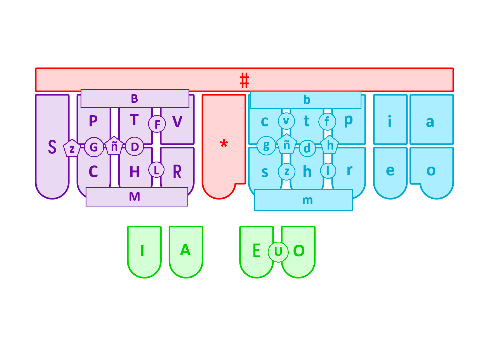

# Plover implementation of Spanish Melani system

Based on https://gist.github.com/sammdot/84c601404c6a74c0895c294ab4b818be

Originally worked from the [implementation by](https://github.com/nvdaes/plover_spanish_mqd) Sonsoles García Martín, Noelia Ruiz Martínez used at MQD,
I later adopted basically wholesale the [implementation by](https://github.com/opensteno/plover_melani) Benoit Pierre in the opensteno repo,
making the necessary Spanish adaptations as above.

My intention is to provide a simpler, less optimized, less opinionated Melani system implementation for Spanish in Plover, even if it's ultimately less powerful, so to be a reference based on what publicly-available documentation there is.

I am not a professional stenographer. This is a learning project for me.
If anyone has Melani documentation for Spanish,
I would only be too happy to make changes.

## Decisions

The Melani system in the reference uses the `eo` chord sometimes to mark "-os" and sometimes to mark a translations as ending with a consonant.
This "-os" outputting function was shared with `ieao`, and there wasn't an obvious pattern explained where I could find.
Some analysis of the example text might reveal some ergonomic principle.
I decided to keep `eo` as "-os" _only_, for symmetry with `ia` ("-as").
For consonant-final words I decided to use `ao`, 
formerly used for "u", which is a much rarer ending.
"u" is instead done by "ieao", a chord seemingly not elsewhere employed.

## Layout

Other combinations not covered:

### Initial consonants:
- bl — `PTHVR`
- ch — `CH`
- dr — `THR`
- fl — `THVR`
- gu — `PCH`
- h — `SCH`
- j — `PCT`
- ll — `HRhr/`
- ps — `Ps/`
- qu — `PCTHVR` (i.e. all non-`S` keys)
- x — `SPCTH`

### Medial vowels
- ue — `IAEO`
- Accent with added `*`

### Final consonants

- j — `csh`
- nt — `cp`
- sm — `sr`
- x — `csthpr` (i.e. all non-vowel keys)
